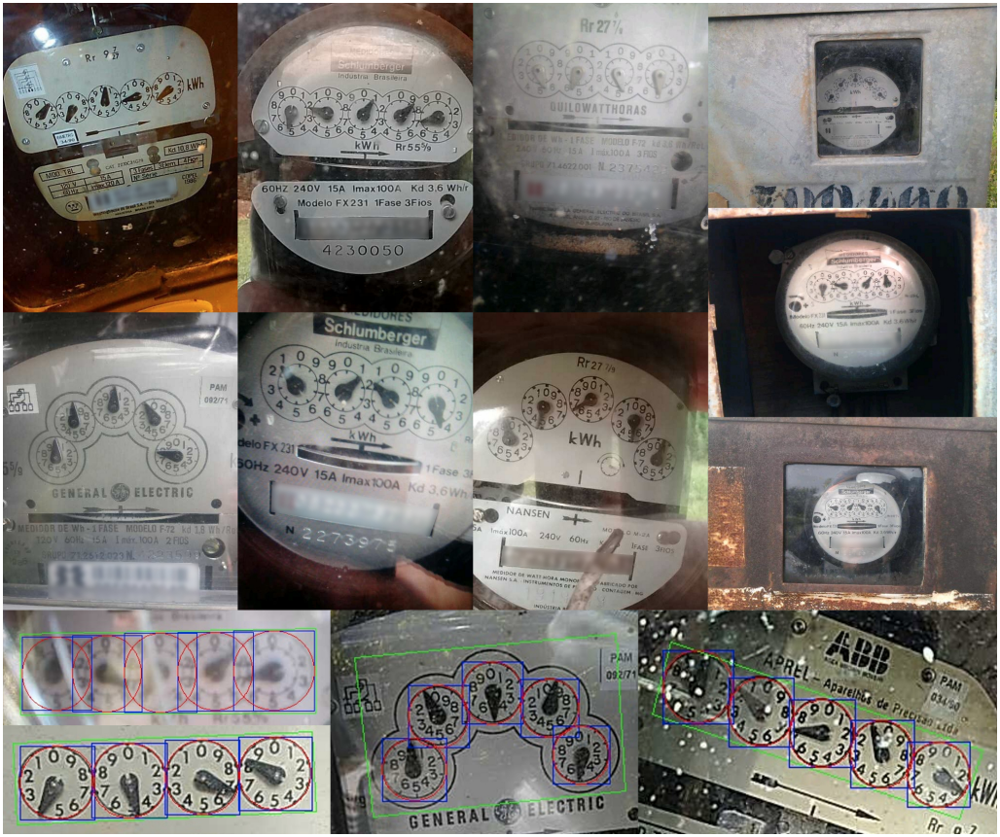

# UFPR-ADMR Dataset ([Website](https://web.inf.ufpr.br/vri/databases/ufpr-admr/))

This dataset, called UFPR-ADMR dataset, contains 2,000 dial meter images obtained on-site by employees of the Energy Company of Paraná (Copel), which serves more than 4 million consuming units in the Brazilian state of Paraná. The images were acquired with many different cameras and are available in the JPG format with 320×640 or 640×320 pixels (depending on the camera orientation). More details are available in our IJCNN paper [[PDF]](./pdfs/salomon2020deep.pdf).

The dataset is split into three sets: training (1200 images), validation (400 images) and testing (400 images). Every image has the following annotations available in a .txt file: the counter’s corners (x1, y1), (x2, y2), (x3, y3), (x4, y4). The corners can be used to rectify the counter patch and represent, respectively, the top-left, top-right, bottom-right and bottom-left corners. For each dial, the current position (x, y, w, h) and the corresponding reading (pointed values and final reading). All counters of the dataset (regardless of meter type) have 4 or 5 dials; thus, 9,097 dials were manually annotated. The full details and statistics regarding the dataset are available in our [paper](./pdfs/salomon2020deep.pdf).

Here are some examples from the dataset:  


## How to obtain the Dataset

The UFPR-ADMR dataset is the property of the Energy Company of Paraná (Copel) and is released **only** to academic researchers from educational or research institutes for **non-commercial purposes**. 

To be able to download the dataset, please read carefully [**this license agreement**](./pdfs/license-agreement.pdf), fill it out and send it back to Professor David Menotti ([menotti@inf.ufpr.br](mailto:menotti@inf.ufpr.br)). The license agreement MUST be reviewed and signed by the individual or entity authorized to make legal commitments on behalf of the institution or corporation (e.g., Department/Administrative Head, or similar). **We cannot accept licenses signed by students or faculty members.**

## Citation

If you use the UFPR-ADMR dataset in your research, please cite our paper:

* G. Salomon, R. Laroca, D. Menotti, “Deep Learning for Image-based Automatic Dial Meter Reading: Dataset and Baselines” in International Joint Conference on Neural Networks (IJCNN), July 2020, pp. 1–8. [[IEEE Xplore]](https://www.doi.org/10.1109/IJCNN48605.2020.9207318) [[arXiv]](https://arxiv.org/abs/2005.03106)

```
@INPROCEEDINGS{salomon2020deep, 
  author={G. {Salomon} and R. {Laroca} and D. {Menotti}}, 
  booktitle={International Joint Conference on Neural Networks (IJCNN)}, 
  title={Deep Learning for Image-based Automatic Dial Meter Reading: Dataset and Baselines}, 
  year={2020}, 
  volume={}, 
  number={}, 
  pages={1-8}, 
  month={July},
  doi={10.1109/IJCNN48605.2020.9207318},
}
```

## Contact

Please contact Professor David Menotti ([menotti@inf.ufpr.br](mailto:menotti@inf.ufpr.br)) with questions or comments.